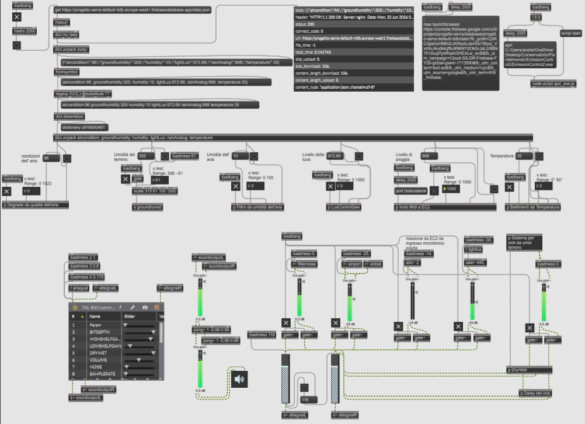

# Sonificazione di una serra

---
   
## Abstract
Sebbene la visualizzazione grafica tradizionale offra un'immediata lettura dei dati ambientali, essa vincola l'utente a un monitoraggio visivo costante e diretto. Prendendo come riferimento concettuale l'efficacia e l'immediatezza acustica di dispositivi come il contatore Geiger, questo lavoro esplora la sonificazione come soluzione per facilitare la comprensione dei mutamenti ambientali quando non è possibile l'interazione visiva. Il sistema si basa su una rete di sensori hardware per la raccolta dei parametri in tempo reale; i dati estratti vengono successivamente veicolati e processati attraverso software dedicati alla programmazione audio e alla sintesi sonora generativa. Il risultato è la creazione di una tessitura acustica complessa e in continuo mutamento, in cui le variazioni timbriche e le tecniche di sintesi rispecchiano fedelmente i micromutamenti e le relazioni interne dei singoli dati a disposizione. Il progetto si configura, in ultima analisi, come un'installazione sonora *site-specific*: un ambiente acustico a livello artistico capace di offrire un'esperienza estetica immersiva e, al contempo, un riconoscimento acustico immediato delle mutazioni del luogo in cui il sistema è allocato.

**Keywords:** Sonificazione, Installazione site-specific, Sintesi generativa, Monitoraggio ambientale, Percezione acustica.

---

## Demo

### 1. Prototipo Hardware & Cloud Infrastructure
Il sistema si avvale di una stazione di rilevamento ambientale basata su microcontrollore Arduino. I dati analogici e digitali estratti dai sensori vengono inviati in tempo reale a un database cloud Firebase (Realtime Database) per la storicizzazione e l'accessibilità remota.


*Fig. 1: Prototipo hardware del sistema di rilevamento su breadboard.*


*Fig. 2: Struttura dei dati JSON (payload) in tempo reale e storico delle rilevazioni su Firebase.*

---

### 2. Architettura Software Principale (Max/MSP)
Il cuore del sistema è sviluppato in Max/MSP. La patch principale effettua richieste HTTP GET cicliche tramite l'oggetto `maxurl` per ottenere il payload JSON da Firebase, ne esegue il parsing (`dict.unpack`) e smista i singoli parametri verso sotto-moduli dedicati alla sintesi e al mapping MIDI. Inoltre, un'istanza `node.script` automatizza l'avvio del software di sintesi granulare esterno.


*Fig. 3: Patch principale di Max/MSP con logica di ricezione, deserializzazione JSON e routing del segnale.*

---

### 3. Sotto-moduli di Trattamento e Sintesi del Segnale
Ogni parametro ambientale influisce in modo univoco su un aspetto specifico del disegno sonoro e della sintesi interna.

#### A. Umidità del Terreno (`p s groundhumid`)
L'umidità del terreno pilota un generatore di click basato su impulsi e risonatori. Il segnale viene poi processato da moduli interni per la gestione del delay e del bilanciamento Dry/Wet.
<p align="center">
  
  
  
</p>
*Fig. 4: Modulo di generazione click, sub-patch di gestione del delay e del crossfade Dry/Wet legati all'umidità del terreno.*

#### B. Qualità dell'Aria (`p Degrade da qualità dell'aria`)
I dati sulla qualità dell'aria controllano i parametri di Sample Rate e Noise applicati a un distorsore digitale (Bitcrusher TAL), degradando lo spettro armonico in base alla purezza dell'ambiente.


*Fig. 5: Sub-patch di degradazione del segnale audio tramite controllo dei parametri del Bitcrusher.*

#### C. Umidità dell'Aria (`p Filtro da umidità dell'aria`)
L'umidità atmosferica agisce direttamente sulla frequenza di taglio e sul fattore di guadagno (Q) di un filtro passa-banda (`biquad~`) applicato a un generatore di rumore rosa interno (`pink~`).


*Fig. 6: Sub-patch di filtraggio selettivo del rumore rosa basato sull'umidità dell'aria.*

#### D. Livello di Pioggia e Controllo MIDI Esterno (`p Invio Midi a EC2`)
Il livello di pioggia viene scalato in tempo reale nel range standard 0-127 e convertito in messaggi di Control Change (CC) tramite pacchetti MIDI formattati (`pack 176 10 0`), indirizzati direttamente a Emission Control 2 tramite la porta virtuale di loopMIDI.


*Fig. 7: Sotto-patch per la generazione e l'invio dei messaggi MIDI di controllo.*

---

### 4. Motore di Sintesi Granulare (Emission Control 2)
Il flusso macrostrutturalmente generato da Max/MSP e i dati MIDI di controllo atterrano su *Emission Control 2* di Curtis Roads. Qui vanno a modulare i parametri microsound (come Grain Rate, Asynchronicity, Duration) per generare la tessitura acustica complessa e in continuo mutamento dell'installazione.


*Fig. 8: Schermata di controllo dei granuli e dei modulatori in Emission Control 2.*

---

## Technical Notes

> Short explanation of **how the project works**.  
> Include:

- Overview of architecture, technologies used (e.g., Python, Max/MSP, Arduino, etc.)
- Link to key repository folders (e.g., `src/`, `hardware/`, `docs/`)
- Any **dependencies** or **external libraries** (list them with versions if necessary)

Example:
```markdown
- Programming Language: Python 3.11
- Main dependencies: numpy, pyo, OpenCV
- Repository Structure:
  - `/src/` – main code
  - `/hardware/` – schematics and designs
  - `/docs/` – documentation and instruction manuals
```

---

## Instructions

> Explain **how to install, run, or build** the project.  
> This could include:

- Installation steps
- Compilation or setup instructions
- Building or assembling (for hardware/instruments)

Example:
1. Clone the repository:
```bash
   git clone https://github.com/yourusername/yourproject.git
```
2. Install dependencies:
```bash
   pip install -r requirements.txt
```

### Running
```bash
python3 main.py
```

### Building the Instrument
See [Instruction Manual](Documentation/Instructions/BUILD.md) for full assembly instructions.
```

If the instructions are too long ➔ **Link to separate file** (e.g., inside `Documentation/Instructions/` folder).

---