# Sonificazione di una serra

---
   
## Abstract
Sebbene la visualizzazione grafica tradizionale offra un'immediata lettura dei dati ambientali, essa vincola l'utente a un monitoraggio visivo costante e diretto. Prendendo come riferimento concettuale l'efficacia e l'immediatezza acustica di dispositivi come il contatore Geiger, questo lavoro esplora la sonificazione come soluzione per facilitare la comprensione dei mutamenti ambientali quando non è possibile l'interazione visiva. Il sistema si basa su una rete di sensori hardware per la raccolta dei parametri in tempo reale; i dati estratti vengono successivamente veicolati e processati attraverso software dedicati alla programmazione audio e alla sintesi sonora generativa. Il risultato è la creazione di una tessitura acustica complessa e in continuo mutamento, in cui le variazioni timbriche e le tecniche di sintesi rispecchiano fedelmente i micromutamenti e le relazioni interne dei singoli dati a disposizione. Il progetto si configura, in ultima analisi, come un'installazione sonora *site-specific*: un ambiente acustico a livello artistico capace di offrire un'esperienza estetica immersiva e, al contempo, un riconoscimento acustico immediato delle mutazioni del luogo in cui il sistema è allocato.

**Keywords:** Sonificazione, Installazione site-specific, Sintesi generativa, Monitoraggio ambientale, Percezione acustica.

---

## Demo

### 1. Prototipo Hardware & Cloud Infrastructure
Il sistema si avvale di una stazione di rilevamento ambientale basata su microcontrollore Arduino. I dati analogici e digitali estratti dai sensori vengono inviati in tempo reale a un database cloud Firebase (Realtime Database) per la storicizzazione e l'accessibilità remota.

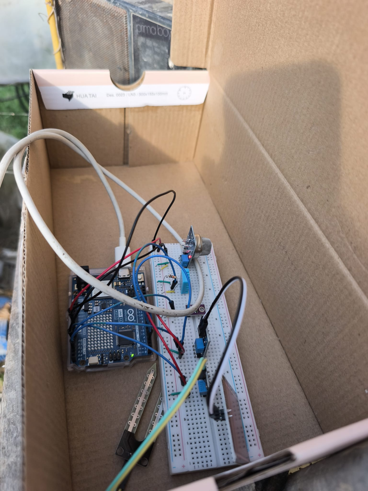
*Fig. 1: Prototipo hardware del sistema di rilevamento su breadboard.*

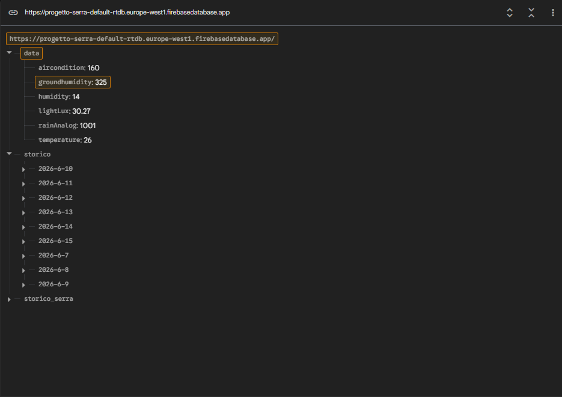
*Fig. 2: Struttura dei dati JSON (payload) in tempo reale e storico delle rilevazioni su Firebase.*

---

### 2. Architettura Software Principale (Max/MSP)
Il cuore del sistema è sviluppato in Max/MSP. La patch principale effettua richieste HTTP GET cicliche tramite l'oggetto `maxurl` per ottenere il payload JSON da Firebase, ne esegue il parsing (`dict.unpack`) e smista i singoli parametri verso sotto-moduli dedicati alla sintesi e al mapping MIDI. Inoltre, un'istanza `node.script` automatizza l'avvio del software di sintesi granulare esterno.

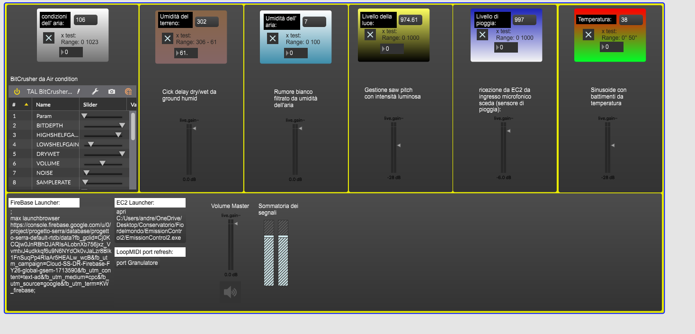
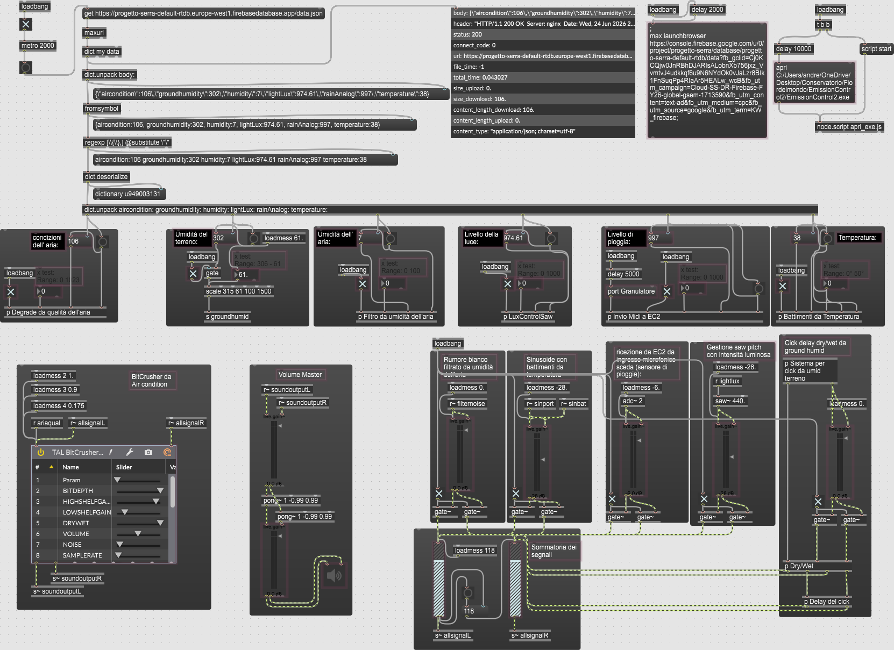
*Fig. 3: Patch principale di Max/MSP con logica di ricezione, deserializzazione JSON e routing del segnale.*

---

### 3. Sotto-moduli di Trattamento e Sintesi del Segnale
Ogni parametro ambientale influisce in modo univoco su un aspetto specifico del disegno sonoro e della sintesi interna.

#### A. Umidità del Terreno (`p s groundhumid`)
L'umidità del terreno pilota un generatore di click basato su impulsi e risonatori. Il segnale viene poi processato da moduli interni per la gestione del delay e del bilanciamento Dry/Wet.

  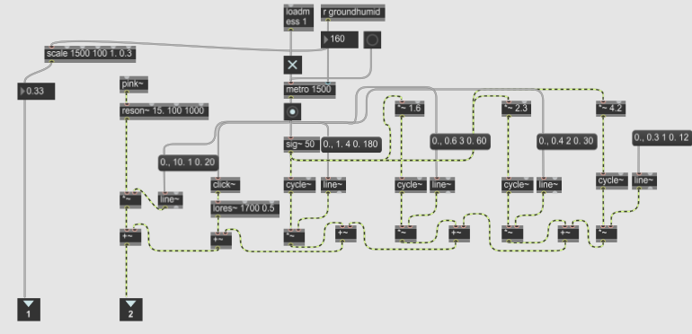
  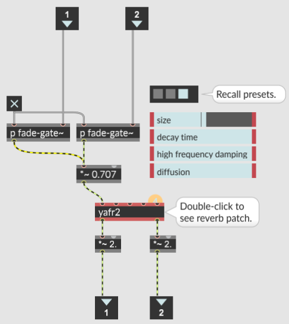
  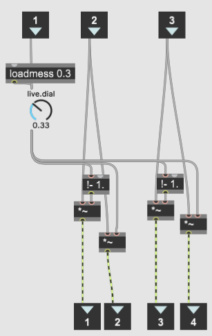

*Fig. 4: Modulo di generazione click, sub-patch di gestione del delay e del crossfade Dry/Wet legati all'umidità del terreno.*

#### B. Qualità dell'Aria (`p Degrade da qualità dell'aria`)
I dati sulla qualità dell'aria controllano i parametri di Sample Rate e Noise applicati a un distorsore digitale (Bitcrusher TAL), degradando lo spettro armonico in base alla purezza dell'ambiente.

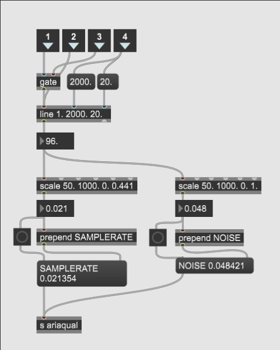 
*Fig. 5: Sub-patch di degradazione del segnale audio tramite controllo dei parametri del Bitcrusher.*

#### C. Umidità dell'Aria (`p Filtro da umidità dell'aria`)
L'umidità atmosferica agisce direttamente sulla frequenza di taglio e sul fattore di guadagno (Q) di un filtro passa-banda (`biquad~`) applicato a un generatore di rumore rosa interno (`pink~`).

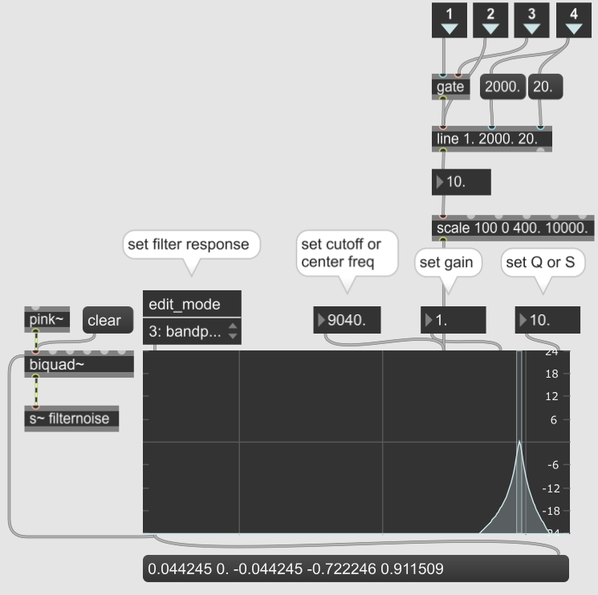
*Fig. 6: Sub-patch di filtraggio selettivo del rumore rosa basato sull'umidità dell'aria.*

#### D. Livello di Pioggia e Controllo MIDI Esterno (`p Invio Midi a EC2`)
Il livello di pioggia viene scalato in tempo reale nel range standard 0-127 e convertito in messaggi di Control Change (CC) tramite pacchetti MIDI formattati (`pack 176 10 0`), indirizzati direttamente a Emission Control 2 tramite la porta virtuale di loopMIDI.

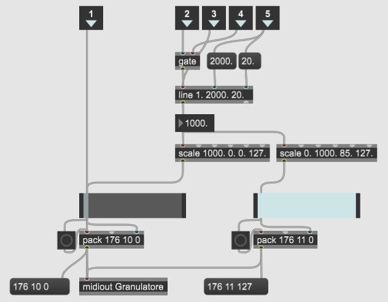
*Fig. 7: Sotto-patch per la generazione e l'invio dei messaggi MIDI di controllo.*

---

### 4. Motore di Sintesi Granulare (Emission Control 2)
Il flusso macrostrutturalmente generato da Max/MSP e i dati MIDI di controllo atterrano su *Emission Control 2* di Curtis Roads. Qui vanno a modulare i parametri microsound (come Grain Rate, Asynchronicity, Duration) per generare la tessitura acustica complessa e in continuo mutamento dell'installazione.

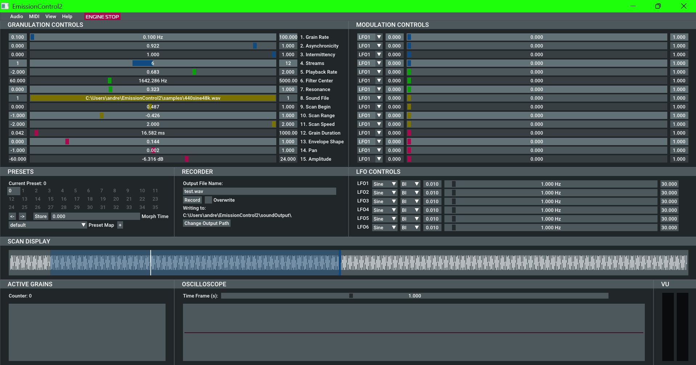
*Fig. 8: Schermata di controllo dei granuli e dei modulatori in Emission Control 2.*

---

## Technical Notes

L'architettura del sistema si sviluppa come un ecosistema IoT (Internet of Things) applicato al Sound Design generativo, articolandosi su tre macro-livelli interconnessi: l'estrazione dei dati ambientali, l'infrastruttura di rete cloud e l'ambiente di elaborazione e sintesi sonora.

### Infrastruttura e Flusso dei Dati
1. **Raccolta Hardware (Edge):** Un microcontrollore Arduino acquisisce i dati in tempo reale dai sensori ambientali collocati nella serra. Per limitare i fenomeni di ossidazione e corrosione precoce dovuti all'elettrolisi, i sensori igrometrici e di pioggia vengono alimentati elettricamente a impulsi (VCC controllato da pin digitali) esclusivamente durante la finestra di lettura di 30 millisecondi.
2. **Cloud Datastore (Firebase):** I dati raccolti dall'hardware vengono spediti in rete e memorizzati su un database Firebase in formato JSON (Realtime Database). Il firmware gestisce due flussi paralleli: uno streaming in tempo reale ad alta frequenza (ogni 2 secondi) e una routine di storicizzazione ciclica (ogni 20 minuti) dotata di un algoritmo auto-pulente basato sulla libreria NTP che rimuove automaticamente i log più vecchi di 8 giorni.
3. **Elaborazione e Routing (Max/MSP):** Tramite chiamate HTTP GET cicliche (`maxurl`), Max/MSP interroga il database cloud, esegue il parsing del payload JSON (`dict.unpack`) e mappa i parametri numerici su algoritmi di sintesi interna o su flussi di controllo MIDI virtuali.
4. **Motore Microsound Ext (Emission Control 2):** I messaggi di Control Change generati e scalati da Max vengono instradati tramite la porta virtuale di loopMIDI verso *Emission Control 2*, pilotando i parametri della sintesi granulare in tempo reale.

### Tecnologie Utilizzate
- **Hardware:** Arduino Uno R4 WiFi + Sensori ambientali (DHT11, MQ135, fotoresistenza, pioggia, igrometro).
- **Infrastruttura Cloud:** Firebase Realtime Database (Google) + Libreria NTPClient per la sincronizzazione temporale.
- **Ambiente di Sviluppo Audio:** Max/MSP 8 (con moduli `node.script` per l'automazione dei processi di sistema).
- **Virtual MIDI Routing:** loopMIDI (creazione e gestione delle porte MIDI virtuali).
- **Software di Sintesi Esterna:** Emission Control 2 (EC2) di Curtis Roads.

### Allocazione delle Risorse nella Repository
I file del progetto sono distribuiti secondo la seguente struttura ad albero:
- `/hardware/` – Intera cartella di sviluppo dell'Arduino IDE, contenente lo sketch principale (`.ino`) e il file di configurazione delle credenziali di rete (`secrets.h`).
- `/software/` – Directory dedicata agli applicativi desktop:
  - `/MaxMSP/` – Patch principale di Max (`.maxpat`) e script JavaScript integrati.
  - `/Emission Control/` – File esecutivi di installazione del software EC2 e relativi preset.
  - File esecutivi di installazione per loopMIDI.
- `/documentation/` – Documentazione teorica del progetto e sottocartella `/images/` contenente i media dell'installazione.
- `/files/` – Destinata a ospitare campioni audio esterni, preset addizionali o file JSON per i test offline.

---

## Instructions

Per configurare ed eseguire correttamente l'intero ecosistema sul proprio computer, seguire i passaggi descritti di seguito.

### 1. Configurazione Hardware (Arduino)
1. Collegare i sensori e le relative alimentazioni controllate alla scheda Arduino Uno R4 WiFi seguendo lo schema di mappatura dei pin reale estratto dal codice sorgente:

| Componente / Sensore | Tipo di Segnale / Funzione | Pin Arduino |
| :--- | :--- | :--- |
| **Umidità dell'Aria / Temperatura (DHT11)** | Digitale (Dati) | `D2` |
| **Umidità del Terreno (Igrometro)** | Analogico (Lettura) | `A0` |
| **Qualità dell'Aria (MQ135)** | Analogico (Lettura) | `A1` |
| **Livello di Luce (Fotoresistenza)** | Analogico (Lettura) | `A2` |
| **Livello di Pioggia (Quantitativo)** | Analogico (Lettura) | `A3` |
| **Soglia Pioggia (Presenza/Assenza)** | Digitale (Lettura ON/OFF) | `D4` |
| **Alimentazione Switch Terreno (VCC)** | OUTPUT Digitale (Protezione Elettrolisi) | `D7` |
| **Alimentazione Switch Pioggia (VCC)** | OUTPUT Digitale (Protezione Ossidazione) | `D5` |

2. Aprire la cartella `/hardware/` che racchiude l'ambiente di sviluppo dell'Arduino IDE.
3. Aprire il file `secrets.h` e configurare le stringhe relative alle credenziali della propria rete Wi-Fi.
4. Connettere la scheda Arduino al computer tramite USB e caricare lo sketch principale (`.ino`) tramite Arduino IDE.

### 2. Configurazione Cloud (Firebase Realtime Database)
Il sistema richiede un'istanza attiva di Firebase per la trasmissione e la ricezione dei dati ambientali.
1. Creare un progetto sulla console di Firebase e attivare un **Realtime Database**.
2. Nella scheda **Rules** (Regole) del database, incollare il seguente codice JSON per disabilitare momentaneamente le restrizioni di autenticazione e permettere i test di lettura/scrittura in modalità pubblica:

   {
     "rules": {
       ".read": true,
       ".write": true
     }
   }

3. Il firmware provvederà a creare autonomamente un nodo fisso principale chiamato data per lo streaming realtime a 2 secondi (utilizzato da Max/MSP) e un nodo storico/ organizzato in ordine cronologico con auto-pulizia automatica a 8 giorni per i report a lungo termine.

4. Recuperare l'URL del database e il relativo Token di autenticazione e inserirli sia nel file secrets.h di Arduino, sia all'interno del modulo di ricezione web della patch di Max/MSP.

### 3. Configurazione del Virtual MIDI Routing
Il sistema necessita di un canale MIDI virtuale per far comunicare Max/MSP con il motore di sintesi esterno.

1. Se non è presente sul sistema, installare loopMIDI (i file di installazione sono reperibili nella cartella /software/).

2. Aprire loopMIDI e creare una nuova porta virtuale rinominandola esattamente: Granulatore.

### 4. Configurazione dell'Ambiente Audio e Avvio (Max/MSP)
1. Assicurarsi di aver installato Emission Control 2 (i file di installazione esecutivi e i preset si trovano all'interno di /software/Emission Control/).

2. Aprire la patch principale di Max/MSP situata nella directory /software/MaxMSP/ (.maxpat).

3. Controllo propedeutico dei percorsi (Path Linking): Prima di avviare il sistema, verificare all'interno dello script Node della patch che i riferimenti alle cartelle locali del computer siano corretti e aggiornati. Se i percorsi assoluti differiscono o contengono stringhe errate, lo script genererà un blocco di sistema non trovando i riferimenti dell'eseguibile.

4. All'apertura della patch, l'oggetto node.script interagirà con il sistema operativo per automatizzare l'inizializzazione dei processi e l'avvio in background di Emission Control 2.

5. Fallback di Avvio Manuale: Qualora l'automatismo dello script dovesse fallire o bloccarsi a causa di restrizioni sui permessi amministrativi del sistema operativo, basterà cliccare manualmente sul rispettivo riquadro di comando (messaggio di avvio forzato) presente sulla GUI della patch per lanciare istantaneamente Emission Control 2.

6. Verificare che l'oggetto MIDI in uscita dalla patch sia indirizzato sulla porta virtuale Granulatore creata precedentemente.

7. Attivare il motore audio di Max/MSP (dac~) per iniziare la ricezione dei flussi JSON e dare inizio alla sonificazione generativa.

### Building the Instrument
Vedere la tabella di mappatura dei pin integrata nella sezione precedente per il cablaggio dei sensori sulla breadboard di Arduino Uno R4 WiFi. 

Per una descrizione dettagliata del montaggio fisico dei sensori all'interno della struttura della serra, fare riferimento alla documentazione presente nella cartella `/documentation/`.

---